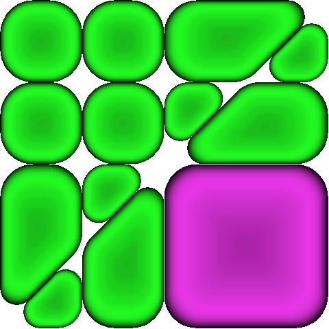

<!--
simplex
cosmo
united
readable
-->

<!--  -->


# Introduction 
Cell Division is a strategy-based board game with a biology inspired theme.  This game is intended for those who like strategy/puzzles and dislike luck/probability^[One of the motivations for creating this game was out of frustration with Candy Crush which after awhile becomes a game of luck rather than skill.].  All A.I. opponents implement a deterministic strategy that is greedy with respect to an approximate value function.  Games against a fixed difficulty A.I. opponent are completely reproducible and can be thought of as a type of puzzle; i.e., you can design a strategy that specifically exploits the A.I. opponent's weaknesses.  

# Implementation
Cell Division was written entirely^[Basic HTML and CSS were also used.] in the [R programming](https://cran.r-project.org/) language; in fact, even this about page was written using R.  The user interface and the server logic was created using RStudio's [Shiny](http://shiny.rstudio.com/) web app framework.  The main display uses base R graphics --- the display is essentially just a plot of squares and lines in the x-y plane --- and the visual effects come from the [shinyjs](https://github.com/daattali/shinyjs) package.

The code for the game is available [here](https://github.com/mattmotoki/Games.ai/tree/master/Cell%20Division).


# Creating The Cells
Rather than drawing squares it is more visually appealing to show cartoons of cells.  This section describes the process of creating cells from scratch using base R graphics.


## Raster Cells
The simplest way to create the cells is to create a raster image (that is, a grid of pixels) for example, the logo fro Cell Division is a raster image:
<center></center>


### Defining the Outline


Cells are drawn as layered polygons in base R.  Before calling the `polygon` function we must create a new plot.  The `blank_plot` function creates a new empty plot and draws lines to highlight the edges of the cell which we will take to be -0.5 and 0.5 in both directions. 
```{r}
blank_plot <- function() {
  plot(1, type="n", asp=1,
       yaxs="i", xaxs="i", xlab = "", ylab = "",
       xlim = c(-0.1, 1.1), ylim = c(-0.1, 1.1)
  )
  abline(h=c(0, 1), v=c(0, 1))  
}
```

For example, the outline of a single cell can be created using the following function
```{r}
square_cell <- function(r, n_pnts) {
  R <- rep(r, n_pnts)
  theta <- seq(0, 2*pi, length.out = 4*n_pnts)
  
  x <- r*cos(theta) + c(1-R, R, R, 1-R) 
  y <- r*sin(theta) + c(1-R, 1-R, R, R) 
  cbind(x, y)
}

# create outline for a single cell with 5 points per corner
sq_outline <- square_cell(0.1, 5)
x <- sq_outline[, 1]
y <- sq_outline[, 2]

# plot green cell
cellgreen <- c(34/255,250/255,34/255)
blank_plot()
polygon(x, y, col=rgb(cellgreen[1], cellgreen[2], cellgreen[3]), lwd=2)
points(x, y, pch =20)
```

More complex shapes can be achieved in a similar fashion.


### Shading About the Center of Mass
There are two types of shading used to create the cells.  Both types of shading are implemented by plotting a sequence of polygons centered about the center of mass with either decreasing/increasing size and decreasing/increasing transparency. 

The center of mass (COM) can be calculated using the following hack.  First, we save the polygon image of the cell as a temporary png.  When we can then read it back into R as a 3-dimensional matrix (two dimensions for x and y and the third dimension for the RGBT value).  The center of mass can then be caluculated by taking inner products between the rows/cols of the transparency matrix and the corresponding y/x values. The `com_calc` takes in the `x` and `y` values of the cell outline and applies the aforementioned hack.
```{r}
com_calc <- function(x, y) {
  # plot and save shape
  png('temp.png', width = 1000, height = 1000)
  par(mar=c(0,0,0,0), bg="NA")
  plot(1, type="n", asp=1, axes = FALSE,
       yaxs="i", xaxs="i", xlab = "", ylab = "",
       xlim = c(0, 1), ylim = c(0, 1)
  )
  polygon(x, y, col=rgb(0,0,0), border=NA)
  dev.off()
  
  # load in shape
  img <- 1*(readPNG("temp.png")[, , 4]>0.5)
  img <- img/sum(img)
  
  # calculate center of mass
  com_x <- sum(img %*% seq(0, 1, length=dim(img)[1]))
  com_y <- 1-sum(t(img) %*% seq(0, 1, length=dim(img)[1]))
  
  c(com_x, com_y)
}
```

With the COM now in hand, we can now create the shadow for the ouline of the cell using a decreasing sequence of polygon size and transparency.  The next style of shading creates a dimple in the middle of the cell and created using an increasing sequence of polygon size and transparency.

```{r}
library(png)

# plot a single cell with shadow and dimple
plot_cell <- function(x, y, color) {
  
  # start with all black cell
  polygon(x, y, col="black", border=NA)
  
  # get center of mass
  com <- com_calc(x, y)
  
  # add shadow
  n_layers <- 100
  shink <- seq(1, 0,length=n_layers)
  alpha <- seq(0.1, 1, length=n_layers)
  for (k in 1:n_layers) {
    polygon(shink[k]*(x-com[1])+com[1], shink[k]*(y-com[2])+com[2],
            col=rgb(color[1], color[2], color[3], alpha[k]),
            border=NA)
  }
  
  # add dimple
  n_layers <- 25
  shink <- seq(0.25, 0.85, length=n_layers)^2
  alpha <- seq(0.01, 0.05, length=n_layers)
  color <- 0.5*color
  for (k in 1:n_layers) {
    polygon(shink[k]*(x-com[1])+com[1], shink[k]*(y-com[2])+com[2],
            col=rgb(color[1], color[2], color[3], alpha[k]),
            border=NA)
  }
}
blank_plot()
plot_cell(x, y, cellgreen)
```

### Smoothing
The final step is to smooth out the values between the edges of the polygons.  This is done in R using smoothing spines.  

```{r}
library(fields)
library(data.table)


blank_plot()
plot_cell(x, y, cellgreen)

img <- readPNG("../www/images/cell_d1.png")
img4 <- img[, ,4]
  

dt <- data.table(x = rep(seq_len(ncol(img4)), each = nrow(img4)),
                 y = rep(seq_len(nrow(img4)), times = ncol(img4)),
                 z = c(img4))


mod <- gam(z ~ te(x, y), data = dt)
img[, , 4] <- matrix(fitted(mod), ncol = ncol(img4))
 

require("lattice")
wireframe(m2)
rasterImage(img)
```


## SVG Cells
Next step cells as svgs. Because we already defined the outline of the cells in terms of their outlines, it may not be too hard to create cells as svgs.  This will also allow for creating better animations such as cell splitting which can be achieved by overlapping outlines. 


# A.I. Opponent
First, it should be noted that every single one of the opponent's strategies are hard-coded.  Therefore, it is technically not correct to call the opponent "A.I.".  However, creating making the opponent consitent with typical definitions of A.I. would not be too difficult and it's implementation is discussed in a following section. 


## Thinking like the "A.I." Opponent
In order to beat your opponent, you should think like your opponent.  

All oppponent's follow a greedy with respect to some approximation of the value of a move.  The quality of the approximation determines the difficulty of the opponent.  Since the objective is to maximize your score, it makes sense to approximate the long term benefit of a move with its immediate increase in score.  It turn's out that the increase in score can be decomposed in the a function of the following four variables: 

* $\text{overlap}(\text{move})$ is the number of cells adjacent to a move,
* $\text{interlap}(\text{move})$ is the number of times the move is sandwitched by it's cell and it's opposite
* $\text{extensions}(\text{move})$ is the number of existing connections that a move extends
* $\text{unconnected}(\text{move})$ is the number of unconnected cells that a move connects,

and the formula is 

$$\begin{split}
\Delta \text{score}_p(\text{move}) 
&= \mathbb{I} \{\text{overlap}(\text{move})>1\} - \text{unconnected}(\text{move}) \\
&\quad + 2\cdot \big[\text{overlap}(\text{move}) - \text{interlap}(\text{move})\big] \\
&\quad + 2\cdot\big[  \text{overlap}(\text{move})  - \text{extensions}(\text{move}) \big],
\end{split}$$
where $p$ denotes the player playing the move.  By convention, we define the first player ($p=1$) to be you and the second player ($p=2$) to be the A.I.  


One benefit of this decomposition is that each of the variables can themselves be updated in an online fashion.  Thus, we can keep track of the increase in score for every move efficiently. 

Additional variables that have intuitive value are:

* $\text{openness}(\text{move})$ is move number of open positions adjacent to a move,
* $\text{centrality}(\text{move})$ measures how close a move is to the center of the board.

Every opponent uses some (ad-hoc) combination of the above variables. The weights that are used in the combinations are completely arbitrary and can most likely be improved. 

### Easy 
The easy opponent obtains a move by maximizing
$$
\text{easy}(\text{move}) = \text{overlap}(\text{move}) + 0.01 \cdot \text{centrality}(\text{move}).
$$
The overlap is a relatively good approximation for the increase in score of a move; it is only when we extend existing connections or place a move in between two cells do we over count.  The centrality term is intended to be negligible unless a tie occurs, in which case the opponent will prefer moves towards the center of the board.  

### Medium
The medium opponent obtains a move by maximizing
$$
\text{medium}(\text{move}) = \Delta \text{score}_2(\text{move}) + 0.5\cdot \text{openness}(\text{move}) + 0.01 \cdot \text{centrality}(\text{move}).
$$
Here the opponent tries to maximize its increase in score directly.  Again, with the centrality term used to break ties.


### Hard
The hard opponent obtains a move by maximizing
$$\begin{split}
\text{hard}(\text{move}) 
&= \Delta \text{score}_2(\text{move}) 
\quad + 0.75\cdot \Delta \text{score}_1(\text{move}) \\
&\quad + 0.1\cdot \text{openness}(\text{move}) 
\quad + 0.01 \cdot \text{centrality}(\text{move}).
\end{split}$$
The previous two opponents looked only at their own values.  The hard opponent takes into account how much a move will hurt your chances of increasing your own score.  In this way, it is a bit more adversarial than the previous two opponents.  The openness of a move is also given some weight and if all else is equal, the hard opponent will choose a move closest to the center of the board.


### Adaptive
The adaptive opponent has a skill level which determines the overall strategy in a game.  


The adaptive opponent adapts to your play in two ways: 

1. It adapts to your play within a game.
2. It adapts its entire strategy after a game.


Formally, the adaptive player uses a blend (convex combination) of the normalized easy player's score approximation and the normalized hard player's score approximation.  
$$
\text{adaptive}(\text{move}) 
= \text{skill}' \cdot \frac{\text{hard}(\text{move})}{\max\limits_{m}\{ \text{hard}(m) \} } 
+ (1 - \text{skill}') \cdot  \frac{\text{easy} \text{move})}{\max\limits_{m}\{ \text{easy}(m) \} },
$$

where $\text{skill}'$ is the modified skill parameter

$$
\text{skill}' = \text{skill} + ( \text{your score} - \text{A.I.'s score} ).
$$

Notice that if you are winning, then the effective skill of your opponent goes up.  Moreover, if you are winning by a lot then the effective skill will go up by a lot.  

At the end of the game, your opponent's skill level is updated according to the following formula:
$$
\text{skill} \leftarrow \text{skill} + \frac{ \text{your score} - \text{A.I.'s score}  }{1 + \mathbb{I} \{ \text{your score} < \text{A.I.'s score} \}  }.
$$
Hence, if you beat your opponent, then its skill goes up by the score difference; if you lose to your opponent, then its skill goes down by one half the absolute score difference.  If the game is a draw, then the skill level stays the same.


## Improving Opponent Design


# Future Add-Ons
There are many variations on this game that can be played.  What follows is an unordered list of possible improvements/variants of the game.

* **Attack Moves**: Give players access to the strong acid HCl and the strong base NaOH.  Each acid/base will destroy the other player's cells while leaving their cells intact.  Similarly, isopropyl alcohol can be played to destroy any cell.  
+ **Sythesis Process**: Let NaOH/HCl and isopropyl alcohol regenerate over time. 
+ **cell Walls**: Let players enforce their cells with cell walls (or membranes) to guard against HCl/NaOH/Alcochol attacks. 


* **Alternative Objectives**: Instead of placing cells on the board, we can start with a given number of each player's cells in a predefined configuration.  You are allowed to move a cell one step in any direction or swap your cell with an opponent's adjacent cell.  Cells continue to divide based on thier connections.  The end of a game occurs after a fixed number of moves. The winner is the player with the most cells at the end of the game.  
+ **Cell Swap**: Let player's swap their cell's with their oppoent's (enforce [no backsies](http://www.urbandictionary.com/define.php?term=no%20backsies)); 
+ **Cell Jumps**: Let players jump their opponent's cells to convert them to one of their own (as in checkers).

* **Triangular and Hexagonal Grids**: Storing a board defined over these grids can be done by modifying what it means to be adjacent to another cell.  Thus, boards can be stored and analyzed in a similar way to the rectangular grid.  The approximations that the A.I. opponents use will probably also generalize well to these types of grids. 


* **Modified Scoring**: One of the problems with this game is that the scoring system --- although well-defined --- is not very intuitive.  A more natural scoring system may be to count the number of connections rather than the number of divisions.


* **Cell Capture**: This is a <a href="https://en.wikipedia.org/wiki/Go_(game)" target="_blank">Go</a>-like feature which allows you to convert your opponent's cells into your own.  This is achieved by completely surrounding your opponent's cells or sandwiching them between the edge of a board and your cells.  


* **Partial Cells**: Allow and score partial cells. Triangular cell's might not be too hard to add in. 


* **Custom Board Builder**: Create a GUI that allows the user to click on a grid to define the feasible positions of thier custom board.  Boards can naturally be stored as a binary matrix, thus it would be easy to let the user save and upload thier board.  


