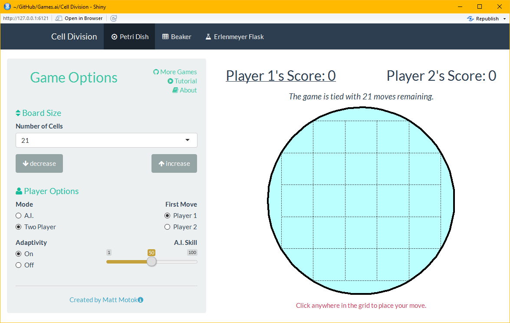
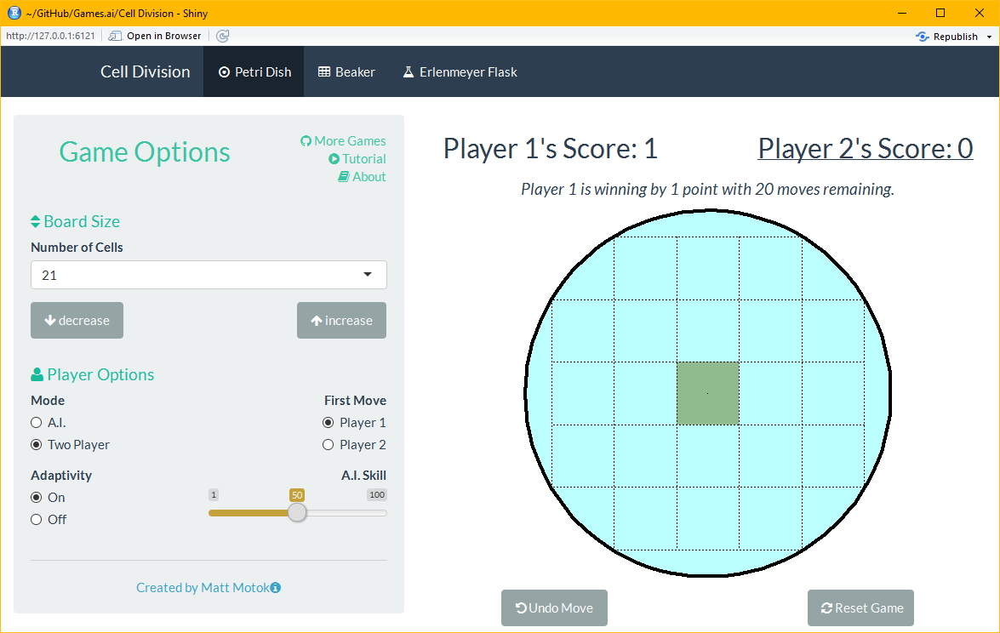
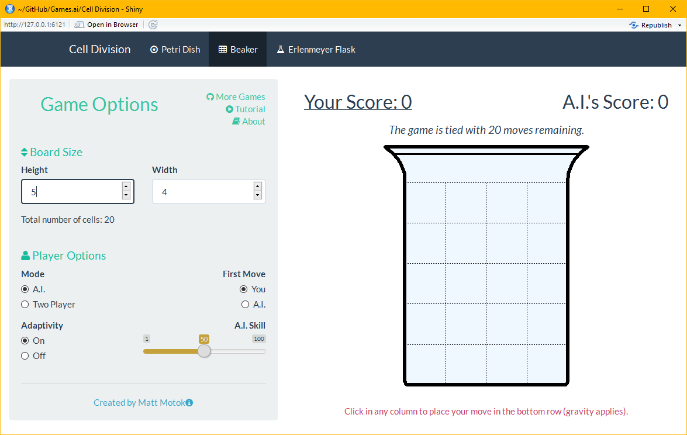
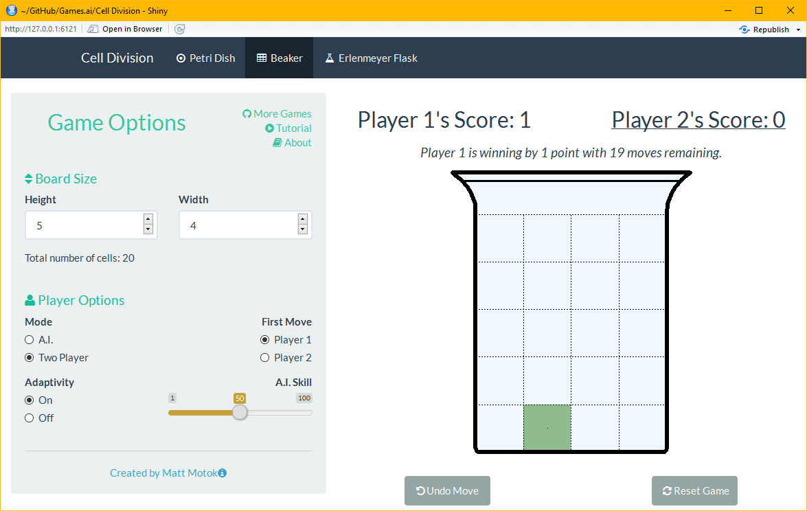
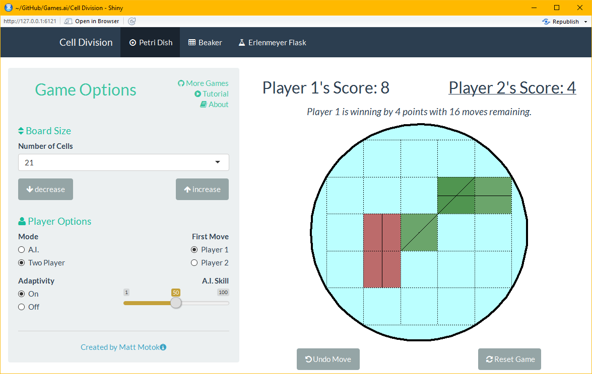
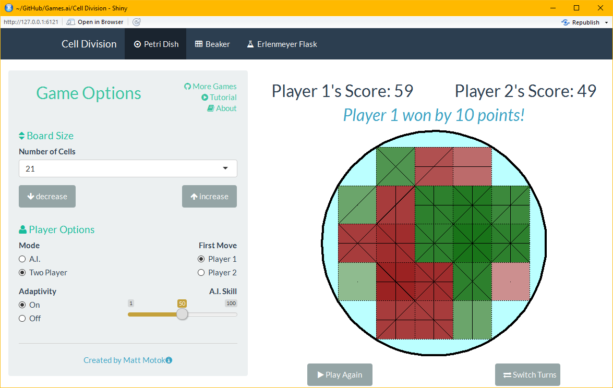

<!--
simplex
cosmo
united
readable
date: "`r format(Sys.time(), '%d %B, %Y')`"
-->

<!--  -->

# How to Play
Cell Division is a strategy-based board game with a biology inspired theme.  

### Select any open position to insert your cell.  For the Petri layout click in any open square.  

### For the beaker and flask layout, cells fall to the lowest row (gravity applies).

### Cells divide into more cells whenever a connection of the same color is made; horizontal, vertical, and diagonal connections are allowed. 

### Your score is equal to the total number of cells with your color. 

### The game ends once the board is full.  The player with the highest score at the end of the game score wins!

